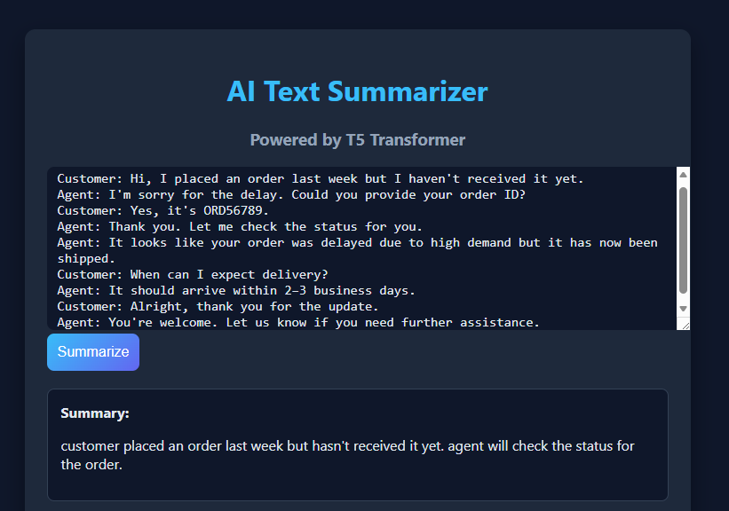

\#Text Summarizer using Fine-Tuned T5


This project is an end-to-end implementation of a \*\*text summarization system\*\* using a fine-tuned \*\*T5 (Text-To-Text Transfer Transformer)\*\* model.


The main goal was to go beyond simply using pretrained models by actually \*\*fine-tuning T5-small on the SAMSum dialogue dataset\*\* and deploying it using \*\*FastAPI\*\* with a simple web interface for real-time summarization.


\---


\## Key Highlights


\- Fine-tuned \*\*T5-small\*\* on dialogue data (SAMSum dataset)  

\- Built a complete ML pipeline: preprocessing → training → inference  

\- Developed a \*\*FastAPI backend\*\* for serving the model  

\- Created a \*\*browser-based UI\*\* for real-time summarization  

\- Implemented text cleaning and tokenization pipeline  


\---


\## Tech Stack


\- Python  

\- Hugging Face Transformers  

\- PyTorch  

\- FastAPI  

\- HTML, CSS  


\---


\##  How to Run the Project


\### 1. Clone the repository


```bash

git clone https://github.com/FaisalTahair/text-summarizer-t5.git

cd text-summarizer-t5

2\. Install dependencies

pip install -r requirements.txt

3\. Run the FastAPI server

uvicorn app:app --reload

4\. Open in browser

http://localhost:8000/

 Example

Input

Customer: Hi, I received a damaged product.

Agent: I'm sorry to hear that. Could you share your order ID?

Customer: Yes, it's 12345.

Agent: Thank you. We will arrange a replacement.

Output

Customer reported a damaged product and the agent arranged a replacement.

 Model Details

Model: T5-small

Fine-tuned on: SAMSum dialogue dataset
```
## 🖼️ Demo


